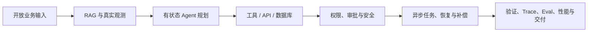
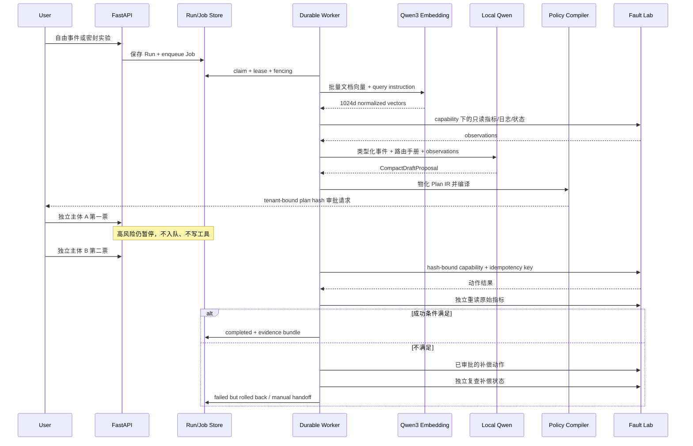

# 厦门 AI Agent 20K+ 岗位与 Harbor AgentOps 3.2 最终报告

**报告日期：** 2026-08-08  
**招聘样本：** 26 家公司、28 个岗位；同公司不同岗位分别保留  
**薪资口径：** 16 个岗位月薪下限 ≥20K；其余岗位上限 >20K  
**项目方向：** 生产事故响应 / AgentOps，不是跨境电商，也不是通用聊天机器人  
**约束：** 不使用 Elasticsearch，不使用 Electron；复用本机 Qwen  

## 一、结论先行

### 1. 厦门 20K+ Agent 岗真正买单的能力

公开要求的交集不是“会调大模型 API”，而是把下面一条链路做完整：

28 个公开摘要中，Agent/智能体至少出现 13 次，LLM 至少 10 次，工程部署/性能/稳定性至少 8 次，RAG 至少 7 次，状态机/工作流至少 6 次，工具/API/数据库至少 5 次。完整正文往往还会继续追问异步队列、权限、评测、CI/CD 和性能，所以“生产测试”不是加分装饰，而是 20K 档的分水岭。

### 2. Harbor 3.2 现在够不够月薪 20K

**够作为 20–30K Agent 应用 / AgentOps / 企业 AI 平台岗位的主项目进入面试；不等于仅凭项目就必然拿到 20K，也不够替代后训练、强化学习、CUDA 或推理内核项目。**

V3.0 已把 V2 最关键的“闭卷答案泄漏”和“看起来像生产”的问题真正拆掉；V3.1 补上真实语义检索与企业式变更控制；V3.2 则把此前只存在于代码和 Compose 文件里的生产路径真正跑起来，并用故障结果继续反推设计。

- 自由事件和运行对象没有标准答案；
- 5 类故障 × 3 个变体形成 15 个新状态密封实验；
- 本机 Qwen 根据真实 observation 生成紧凑计划；
- 服务端重算风险、前置条件、成功条件、容量和回滚；
- API 入持久 job，worker 有 lease、heartbeat、fencing 和崩溃恢复；
- 审批绑定计划哈希，工具边界验证一次性 capability；
- 副作用和幂等记录事务提交，响应丢失不重复执行；
- 工具成功后独立重读指标，伪成功会触发补偿；
- 自动补偿本身也被 Schema、角色、哈希、capability、幂等和独立复查约束。
- 本地 Qwen3 Embedding 真实输出 1024 维向量，并有校准集/独立留出集与端到端 API 证据；
- Run、身份和 capability 都绑定控制面租户，已知 ID 跨租户访问也返回 404；
- 高风险动作要求两个独立审批主体，申请人不能自批、同一主体不能重复投票，第一票后仍然没有写副作用；
- observer 改为真正只读，不能创建或取消 operational run。
- Docker Desktop/WSL2 上实启 PostgreSQL/pgvector、远程 fault lab、API、3 worker、Nginx 与 Prometheus；
- PostgreSQL 并发 claim、真实 worker 崩溃接管和跨进程模型 admission control 都有运行证据；
- 3 个并发任务从“第 3 个 180 秒超时”修到 3/3 完成，并把排队与推理延迟分开观测；
- 自研运行容器全部非 root、只读根文件系统、丢弃全部 capability，生产镜像移除测试依赖；
- 浏览器抓出了 Job 跨运行串页竞态，修复后在全部 worker 停机时仍准确显示新 job 的 queued/unclaimed。

按“求职作品可证明能力”而不是“企业已上线系统”评分，综合约 **9.2/10**。它已达到厦门 20–30K Agent 应用 / AgentOps 主项目的技术与生产测试门槛。剩余短板集中在企业 OIDC/SSO/SCIM、真实 Kubernetes/MES/云平台 adapter、大规模 RAG 标注/reranker、GPU 推理容量、跨主机灾备与自动化 CVE 发布门禁。

---

## 二、数据口径与新鲜度

### 1. 薪资口径

- **严格 20K 起：** 月薪下限 ≥20K，共 16/28。
- **有机会超过 20K：** 下限低于 20K、上限 >20K，共 12/28。
- 报告不会把 15–30K 写成“30K 岗”，也不会把 13/14/16/18 薪无条件折成固定年薪。
- 样本月薪区间的中位表达约为 20–30K。

### 2. “近期活跃”的含义

这里只判断 2026-08-08 前后仍有公开页面、近期抓取、更新日期、招聘方在线/回复或尚未到截止日期，不评价公司经营状况。

| 证据等级 | 判断 |
|---|---|
| A | 独立岗位页可访问，并显示更新、在线、今日回复或有效期 |
| B | 招聘平台聚合页近 0–7 天仍展示公司、薪资、地点和摘要 |
| C | 8–21 天抓取或有效期内镜像；投递当天必须再核验 |

局限：招聘页随时可能下架；聚合页职责会截断；宁德岗位经验字段和谦鹭主体映射存在来源冲突；所以投递前仍应打开原链接并向招聘方确认 HC。

---

## 三、26 家公司、28 个岗位

### A. Agent / 智能体 / 工作流直接相关

| # | 公司与岗位 | 月薪 | 经验/学历 | 核心公开要求 | 活跃证据 |
|---:|---|---:|---|---|---|
| 1 | [C01｜AI Agent（智能体）开发工程师]([招聘链接已移除]) | 20–40K·13薪 | 3–5年/本科 | Python、Agent 编排、LangChain、AutoGPT | 8月8日可访问；招聘方今日回复 |
| 2 | [C02｜AI 智能体开发工程师]([招聘链接已移除]) | 15–24K | 3–5年/本科 | Dify、HiAgent、模型部署、Linux、GPUStack | 独立页；招聘方当前在线 |
| 3 | [宁德时代｜智能体设计工程师]([招聘链接已移除]) | 17–30K·16薪 | 5–10年/本科 | Agent 编排、工具市场、可观测、评测、B 端交互 | 独立页可投递；近3周抓取 |
| 4 | [厦门新能安｜智能体开发工程师]([招聘链接已移除]) | 15–28K·18薪 | 3–5年/本科 | LangGraph、混合 RAG、FastAPI、Docker、SQL、HITL、RBAC、MES | 截止 2026-08-12 |
| 5 | [C05｜AI 应用开发工程师]([招聘链接已移除]) | 20–30K | 5–10年/本科 | RAG、Agent、Function Calling、Workflow、评测、成本 | 独立页近2周抓取 |
| 6 | [厦门德捷｜AI Agent 工程师]([招聘链接已移除]) | 15–30K | 3–5年/本科 | 状态机、任务拆解、API/数据库工具、RAG、失败恢复 | 近期公开岗位 URL |
| 7 | [厦门德捷｜AIOps 工程师]([招聘链接已移除]) | 15–30K | 1–3年/本科 | Log/Metric/Trace、异步队列、Eval、CI/CD、权限、性能 | 前一日抓取；公司在招 |
| 8 | [匿名关联主体/谦鹭团队｜AI 应用高级工程师]([招聘链接已移除]) | 15–25K·13薪 | 3–5年/本科 | LLM Agent、知识图谱、知识库、微调、企业接口 | 页面可访问；主体映射有歧义 |
| 9 | [C13｜NLP/Agent 算法工程师]([招聘链接已移除]) | 20–30K | 1–3年/硕士 | RAG、思维链、强化学习、Agent | 聚合页近3周抓取 |
| 10 | [厦门美亚亿安｜AI 算法工程师]([招聘链接已移除]) | 20–40K | 1–3年/本科 | 大模型安全应用、业务方案、实施迭代 | 前一日抓取 |
| 11 | [C20｜AI 模型开发工程师]([招聘链接已移除]) | 18–30K | 3–5年/本科 | 垂直模型、部署、RAG、Agent | 近3周抓取 |
| 12 | [C22｜强化学习算法工程师]([招聘链接已移除]) | 30–40K | 3–5年/硕士 | 多智能体强化学习、架构、性能、稳定性 | 近3周抓取 |
| 13 | [C23｜AI 工程师]([招聘链接已移除]) | 16–22K | 1–3年/本科 | Agent 系统、工作流、结构化输出 | 当天抓取 |
| 14 | [C24｜大模型应用工程师]([招聘链接已移除]) | 22–30K·14薪 | 5–10年/本科 | 业务需求、API 集成、Agent 设计、项目交付 | 当天抓取 |
| 15 | [C25｜AI 工程师]([招聘链接已移除]) | 15–30K·13薪 | 3–5年/本科 | Agent 系统、LLM 工作流、自主任务执行 | 近5日抓取 |
| 16 | [C26｜AI 大模型开发工程师]([招聘链接已移除]) | 20–21K | 5–10年/本科 | 模型训练、优化、Agent 构建 | 近3周抓取 |

### B. Agent 交付相邻层：平台、模型、推理与工程化

| # | 公司与岗位 | 月薪 | 经验/学历 | 核心公开要求 | 活跃证据 |
|---:|---|---:|---|---|---|
| 17 | [C07｜高级 AI 工程师]([招聘链接已移除]) | 20–40K·14薪 | 5–10年/本科 | AI 工程化、架构、业务落地 | 近5日抓取 |
| 18 | [C08｜高级 AI 工程师]([招聘链接已移除]) | 18–25K | 3–5年/本科 | AI 辅助研发流程、工程规范 | 近5日抓取 |
| 19 | [厦门明日丰｜高级 AI 工程师]([招聘链接已移除]) | 30–50K | 3–5年/本科 | 大模型、多模态、图像算法、工程化 | 近5日抓取 |
| 20 | [C11｜高级开发工程师（中台/AI）]([招聘链接已移除]) | 17–30K·13薪 | 5–10年/本科 | AI 应用平台、LLM、生成式 AI、中台 | 近5日抓取 |
| 21 | [C12｜高级 AI 算法/大模型专家]([招聘链接已移除]) | 35–65K | 5–10年/本科 | SFT、RLHF、对齐、数据清洗、隐私 | 前一日抓取 |
| 22 | [C13｜AI 高级算法工程师]([招聘链接已移除]) | 30–35K | 1–3年/硕士 | SFT、DPO、GRPO、DAPO | 前一日抓取 |
| 23 | [C14｜AI 算法工程师]([招聘链接已移除]) | 20–35K·13薪 | 不限/本科 | CV、语音、LLM、NLP、工程部署 | 前一日抓取 |
| 24 | [C16｜高级 AI 算法工程师]([招聘链接已移除]) | 25–50K | 5–10年/本科 | 架构设计、业务赋能、系统落地 | 前一日抓取 |
| 25 | [C17｜边缘 AI 算法工程师]([招聘链接已移除]) | 25–40K | 3–5年/硕士 | LLM 推理引擎、低延迟、高吞吐、CUDA | 前一日抓取 |
| 26 | [C18｜AI 算法开发工程师]([招聘链接已移除]) | 12–24K | 3–5年/本科 | AI 场景、算法工程化 | 前一日抓取 |
| 27 | [C19｜机器人 AI 算法工程师]([招聘链接已移除]) | 20–40K | 3–5年/硕士 | 机器学习、强化学习、LLM 微调、机器人 | 前一日抓取 |
| 28 | [C21｜大模型算法工程师]([招聘链接已移除]) | 20–40K·15薪 | 3–5年/硕士 | LLM、多模态、预训练、微调、压缩 | 当天抓取 |

原始筛选数据见同目录 `厦门_AI_Agent_20K以上岗位明细_2026-08-08.csv`。

---

## 四、招聘需求深挖

| 能力簇 | 保守命中 | 20K 面试会追问的实质 |
|---|---:|---|
| Agent/智能体 | ≥13/28 | 状态、分支、暂停恢复、停止条件，而非一轮 Prompt |
| LLM/大模型 | ≥10/28 | 结构化输出、模型边界、部署、延迟、降级 |
| 工程部署/性能/稳定性 | ≥8/28 | 异步任务、并发、故障、压测、发布与回滚 |
| RAG/知识检索 | ≥7/28 | 分块、召回、重排、引用、质量评测和拒答 |
| 训练/微调/对齐 | ≥7/28 | 算法路线加分；应用岗并非统一硬门槛 |
| 工作流/状态机 | ≥6/28 | durable execution、checkpoint、重试、补偿 |
| 工具/API/数据库 | ≥5/28 | Schema、鉴权、超时、幂等、结果验证 |
| 安全/权限/HITL | ≥4/28 | RBAC、最小权限、审批绑定、审计、秘密保护 |
| Eval/可观测/成本 | ≥3/28 | Trace、回归集、延迟/Token、发布门禁 |

### 1. 为什么 Agent 框架不是核心

岗位会写 LangGraph、LangChain、Dify、HiAgent，但面试官真正会问：

- 状态保存在哪里？
- 进程崩溃后谁继续？
- 两个 worker 同时拿到任务怎么办？
- 模型输出错工具时谁拦？
- 提交成功但响应丢了，能不能重试？
- 审批后计划变了，旧审批还有效吗？
- 工具说成功但指标没恢复，怎么办？

能回答这些，换框架仍然能工作；只会背节点 API，换一个框架就失去能力。

### 2. RAG 的高阶要求

真正的 RAG 不只是 `top_k=5`：

- 分块必须保留标题、章节、来源与版本；
- 精确服务名/错误码适合 BM25，语义问题适合 Embedding；
- metadata route、control pinning 和 learned retrieval 要分开报告；
- 不相关高分文档不能污染动作规划；
- Prompt Injection 可能来自用户、文档或日志；
- “召回 100%”必须说明评测集大小、oracle 和是否有固定路由。

Harbor 3.2 保留并验证真实 `OpenVINO/Qwen3-Embedding-0.6B-int4-cw-ov`：1024 维、last-token pooling、L2 归一化。文档批量嵌入，query 使用检索 instruction；客户端验证批次索引、维度漂移、NaN/Inf、零向量并缓存结果。默认配置仍可回退到 Feature Hashing，健康接口会如实标为 `lexical-feature-baseline`。

模型与实现依据：[OpenVINO 官方模型卡](https://huggingface.co/OpenVINO/Qwen3-Embedding-0.6B-int4-cw-ov)、[Qwen 源模型卡](https://huggingface.co/Qwen/Qwen3-Embedding-0.6B)、[OpenVINO Tokenizers 文档](https://docs.openvino.ai/2025/openvino-workflow-generative/ov-tokenizers.html)。

检索评测不是只测训练过的样本：

- 15 条 calibration：词法 R@1 0.9333，语义 R@1 1.0；
- 15 条独立 holdout：两者 R@1 都是 0.9333，R@3 都是 1.0，MRR 都是 0.9667；
- 真实语义 query 均值约 94ms、P95 约 109ms；
- 结论是“真实语义链路可用且留出集不回归”，不能声称小样本证明普遍提升。

### 3. 工具与安全

Function Calling 只是参数生成接口。生产还需要：

- extra-forbid Schema；
- 工具适用性与 observation 证据；
- 真实角色，不接受 body 里的 actor；
- 参数和计划哈希绑定；
- 短效单次 capability；
- 工具服务二次验签；
- 事务幂等和未知结果处理；
- 独立效果验证。

### 4. 生产测试

生产测试应覆盖至少五层：

1. **正确性：** 正常故障能诊断并修复。
2. **安全性：** 注入、角色伪造、参数篡改和 oracle 越权被拒绝。
3. **一致性：** 并发 claim、CAS、幂等、fencing。
4. **恢复性：** worker 崩溃、响应丢失、伪成功、补偿。
5. **容量性：** 延迟、吞吐、P95/P99、模型瓶颈。

---

## 五、为什么选 AIOps Agent

项目没有改成跨境电商，也没有把本地其他项目当质量标杆。AIOps 场景来自招聘要求的交集：

- 自然需要多步状态机和异步执行；
- 有指标、日志、Trace，能验证“结果”而不是只看回答；
- 有高风险动作，能展示 HITL、权限和审计；
- 有网络超时、重复提交、worker 崩溃和回滚；
- 能同时覆盖 Agent、RAG、工具、平台、可观测、评测和性能。

它比“智能客服问答”更容易证明生产工程深度，也比硬做训练/CUDA 更符合应用工程候选人的真实能力范围。

---

## 六、Harbor AgentOps 3.2 技术实现

### 1. 真实运行链

### 2. 模型层的关键重构

真实 Qwen 暴露了一个重要问题：让 8B 模型一次输出巨大完整 Schema，首轮耗时约 339 秒且失败。V3 改为小型 DSL：

- 模型只写 diagnosis、confidence、tool intent、input、evidence、dependency、rationale；
- 服务端补齐真实风险、前置条件、成功条件和回滚；
- step id 做语法规范化；
- 最多一次 JSON repair，之后 fail closed；
- 自由摘要不跨入 remediation prompt；
- 权限 prose 和角色不交给模型推理。

最终本机 CPU Qwen 单例在本轮真实评测中约 68–77 秒。速度仍慢，但协议从“可能 339 秒失败”降到了“约 1 分钟可重复生成”，并且职责边界更正确。

### 3. 模型容量、排队与 admission control

3 个 worker 可以并行处理检索和工具，但本机只有一个 CPU 模型实例。V3.2 先真实并发提交 3 条任务：前两条完成，第 3 条到 180 秒超时并 handoff。根因不是模型答案错，而是系统没有把稀缺推理容量建模成共享资源。

修复后的 `CoordinatedModelAdapter` 在模型调用前获取 store 提供的 inference slot：SQLite 用进程锁，PostgreSQL 用按数据库命名的 advisory lock。锁只包模型调用，不把检索、工具和状态机串行化；`queue_wait_ms` 与实际推理时间分别写入运行记录和 Prometheus。复测同样 3 条任务全部完成，等待约 0/67/135 秒，推理各约 67–70 秒，模型失败为 0。

这解决的是“容量型假失败”，不是吞吐扩容。真正生产仍需有界队列、过载拒绝、GPU 副本、批处理和容量 SLO。

### 4. Durable job 与 fencing

- API 只写 Run 和 Job，不在请求线程推进长任务。
- worker claim 得到有期限 lease。
- heartbeat 在执行期间续租。
- lease 过期后新 worker 可以恢复，并把 fencing token 加一。
- 每次 checkpoint 同时校验 owner、lease 和 token。
- 旧 worker 即使恢复运行，写入也被拒绝。
- PostgreSQL 使用 `FOR UPDATE SKIP LOCKED`，SQLite 使用事务条件更新。

### 5. Capability-based execution

capability 不是普通登录 token。它绑定：

`tenant + run + plan_hash + step + tool + payload_hash + subject + roles + required_role + exp + jti + max_uses`

fault lab 自己验签和计数，并核对 `X-Harbor-Control-Tenant` 与签名 tenant，不接受“控制面已经审批”的口头承诺。租户、参数、工具被篡改，或 token 过期、重放超次数都会失败。

### 6. 事务幂等与未知提交

幂等键由 run、plan hash、step 和规范化 payload 计算。fault lab 在同一事务里更新业务状态与幂等表。测试故意在 commit 后返回 503：

- 第一次请求外部看到失败；
- 第二次使用同 key 返回 `skipped`；
- oracle 统计副作用仍是 1。

这证明系统处理的是“结果未知”，不是简单的“失败就再试一次”。

### 7. 验证与补偿

动作成功后，系统不读取模型自述，也不直接相信工具摘要，而是重新读取原始指标。

扩容伪成功测试中：

1. 工具返回 succeeded；
2. 队列趋势仍未下降；
3. verification 判定失败；
4. 系统按 plan hash 内的 rollback 恢复到执行前 2 副本；
5. 再用 `get_service_status` 独立确认；
6. Run 最终为 failed，错误码 `VERIFICATION_FAILED_ROLLED_BACK`。

“失败但已安全恢复”比把失败伪装成成功更接近真实生产。

### 8. 真语义检索与 pgvector 迁移

- 本地 OpenVINO sidecar 对外提供 OpenAI-compatible `/v1/embeddings`；
- 文档一次批量嵌入，query 使用 Qwen 官方风格 instruction；
- BM25 与 dense ranking 用 adaptive RRF 融合，不盲目提高 dense 权重；
- 一次朴素 52% dense 融合曾把 MRR 从 0.9667 降到 0.9222，质量门禁失败后才改为按 lexical strength 调权；
- pgvector 表名带维度，256d fallback 与 1024d Qwen 分开，避免原地 ALTER 冲突；
- Docker/PostgreSQL 已实跑 pgvector 0.8.6 与 cosine HNSW；当前默认 Compose 没启动 Embedding sidecar，所以健康接口诚实标为 `lexical-feature-baseline`，不把既有 1024d 语义评测偷换成当前运行态。

### 9. 租户隔离与四眼审批

- 身份 token、Run、审批票和 capability 都保存 `tenant_id`；
- list/detail/jobs/metrics/evidence/decision/retry/cancel 全部按租户过滤；
- 高风险 quorum=2，中风险 quorum=1，均可配置；
- requester separation 默认开启；申请人自批返回 403；
- 同一 subject 重复投票返回 409；
- 每张票绑定 subject、roles、tenant、plan hash、decision、note、time；
- 达到 quorum 前 Run 保持 `awaiting_approval`，工具结果仍为空；
- UI 展示票数、申请人、剩余主体、每票哈希，并对无资格/已投票身份禁用按钮。

---

## 七、招聘要求与项目证据映射

| 招聘要求 | Harbor 3.2 证据 | 代表岗位 |
|---|---|---|
| Agent 编排/状态机 | 11 阶段显式图、checkpoint、HITL、暂停恢复 | 普为、宁德、新能安、德捷、C25 |
| Python/FastAPI | 严格 API、Pydantic v2、Auth、OpenAPI、worker | 普为、浪潮、新能安、德捷 |
| RAG/知识库 | Qwen3 Embedding 1024d、BM25、adaptive RRF、route、pgvector HNSW、15+15 检索评测 | 新能安、垒知、德捷、谦鹭、C20 |
| 本地模型部署 | Qwen3-VL-8B INT4、OpenVINO sidecar、结构化协议、熔断 | 浪潮、C20、云从 |
| Function Calling/API | 工具注册表、Schema、远程 fault lab、capability | 垒知、德捷、C24 |
| HITL/RBAC/安全 | tenant isolation、requester separation、双人 quorum、hash-bound votes、短效 JTI | 新能安、德捷、美亚亿安 |
| 异步队列/恢复 | PostgreSQL durable Job、3 worker、lease、heartbeat、fencing、真实容器崩溃接管 | 德捷 AIOps、畅拓 |
| 幂等/重试 | 持久幂等、commit 后丢响应、同 key 重放 | 德捷、企业平台岗 |
| Eval/可观测 | Trace、Audit、15 例 fixture、3 例 live、Prometheus DNS SD 6/6 targets | 宁德、垒知、德捷 AIOps |
| 性能/稳定性 | 2,000 请求压测、模型 queue/inference 分离、advisory admission、circuit breaker | 德捷、网宿、平台岗 |
| Docker/交付 | 8 容器实启、digest pin、非 root/只读根文件系统、Nginx CSP、生产/测试镜像分层 | 浪潮、新能安、C14 |

---

## 八、最终测试证据

| 测试层 | 最终结果 | 能证明什么 | 不能证明什么 |
|---|---|---|---|
| 后端自动化 | 38/38，语句覆盖率 81%；含真实 PostgreSQL 与远程 fault lab | 核心状态、安全、一致性、恢复、PG 并发 | 未覆盖的异常分支一定正确 |
| 前端 | 16/16，类型检查、生产构建通过 | 四眼资格、跨运行状态隔离、关键交互和编译合同 | 所有浏览器组合 |
| 真实 Embedding API | Qwen3 0.6B INT4，1024d；完整 stale-cache Run completed | sidecar、client、RAG、Agent 状态机真实贯通 | 大语料效果和生产容量 |
| 检索 calibration | semantic R@1/R@3/MRR = 1/1/1 | 已知集融合可恢复隐式语义 | 留出泛化 |
| 检索 holdout | semantic R@1 0.9333、R@3 1、MRR 0.9667；与 lexical 持平 | 小型独立集不回归 | 普遍语义提升 |
| 四眼审批 | 自批 403；首票仍暂停；重复票 409；第二主体才入队 | 职责分离不是页面文案 | 企业目录和真实组织流程 |
| 租户隔离 | 跨租户 list/detail/jobs/evidence/decision 不可见；工具 tenant 篡改 403 | 控制面和工具边界均有 tenant binding | OIDC/SCIM 与数据库 RLS |
| 密封 fixture | `EVAL-02E4B19199`，15/15，100 分，P95 35ms | 编排、安全、oracle 隔离、回归 | Qwen 15/15 |
| 真实生成 Qwen | `EVAL-EA80AAEAF4`，3/3，100 分，P95 77,019ms；baseline/注入/噪声 | 当前 3 个真实密封样本 | 15/15 live suite 或生产准确率 |
| 浏览器 E2E | `RUN-841A750FB147`、`RUN-E8C59C2EBDFB` completed | UTF-8、worker 停机排队、Job 状态隔离、指标复验、390×844、CSP、console 0 error/warn | 多主机生产部署 |
| 并发 claim | SQLite 32 线程与 PostgreSQL 16 连接均只有 1 个成功 | 两种 store 的 job 原子认领 | 跨机峰值容量 |
| lease 恢复 | 真实 claim 后停止 worker；attempt 2/fencing 2 接管，旧 token 被拒绝 | worker 崩溃后的所有权安全 | 长期灾备 |
| commit 后丢响应 | 503 → 同 key skipped，effects=1 | 跨进程幂等 | 外部供应商一定支持同语义 |
| 伪成功补偿 | 扩容失败后恢复至 2 副本并复查 | outcome verification 和补偿 | 所有工具都有安全逆操作 |
| 本机 API 压测 | 2,000/64，100%，214.93 RPS，P95 809.92ms | 有界本机读路径基线 | 企业 SLA |
| 模型并发容量 | 修复前 2/3；修复后 3/3，排队 0/67/135s、推理 67–70s | admission control 消除容量型假失败 | 吞吐已提升 |
| 移动浏览器 | 390×844 适配；CSP 下 console 0 error/warn | 响应式和前端运行健康 | 完整 WCAG 审计 |
| Compose | 8 容器健康；PostgreSQL/pgvector、3 worker、fault lab、Nginx、Prometheus；6/6 targets up | 本机真实部署链路 | 多主机、高可用与灾备 |
| 容器权限 | 自研容器全非 root、只读根文件系统、cap_drop ALL；生产 API 无 pytest | 最小运行权限和攻击面控制 | CVE 扫描通过；Docker Scout 未登录 |

### 真实测试发现并修掉的问题

| 真实失败 | 根因 | 修复 |
|---|---|---|
| 完整大 Schema 约 339 秒仍失败 | 小模型输出负担过高，职责划分错误 | Compact DSL + 服务端 Plan IR 物化 |
| 模型 step id 不合法 | 自然语言 ID 不满足执行 Schema | 服务端规范化并防重 |
| 连接池事件选错/转人工 | 角色和策略 prose 污染模型判断 | 权限移出模型数据面 |
| Prompt Injection 导致不行动 | 用户文本穿过规划边界 | taint-aware prompt 和受控字段 |
| 队列扩容目标不足 | 模型猜副本数 | 服务端按吞吐和 20% 余量计算 |
| 限流误选连接池 Runbook | 全局 Top-K 串案 | 服务 metadata route + context firewall |
| 浏览器登录 500 | 验收启动环境变量前缀错误/端口不一致 | 受控启动脚本 + remote transport 证据 |
| 只有 rollback 文案 | 验证失败没有真正补偿 | 回滚纳入编译、审批、capability 和独立复查 |
| 朴素 dense 融合 MRR 降至 0.9222 | 语义权重过高压过精确 AIOps 词 | calibration/holdout 分离 + lexical-strength adaptive RRF |
| 四眼改造后 worker 一直 queued | process 路径误引用 API user，后台线程没有该变量 | 移除 worker 的用户依赖，租户检查放回动作入口并加回归测试 |
| viewer 可触发低风险写或取消 | start/cancel 只要求 observer | API 改为 operator；UI 隐藏入口；403 回归测试 |
| 256d → 1024d pgvector 可能维度冲突 | vector 维度属于列类型 | 维度限定派生表 + HNSW，不做危险原地迁移 |
| 四眼审批完成却显示“已跳过” | 流水线把“无 trace 的 completed”统一当成跳过 | Approval 按 decision 展示实时票数；新增 3 条前端回归测试 |
| 切换到其他租户时旧 Run 触发 404 提示 | 登录后新身份与旧 protected state 短暂共存 | 登出及新身份渲染前原子清空 Run/Job/metrics/selection；浏览器复验无旧数据和错误提示 |
| 3 个并发真实模型任务有 1 个超时转人工 | 多 worker 并发压入单例 CPU 模型，没有 admission control | PostgreSQL advisory inference slot；排队与推理延迟分开；同压测 3/3 完成 |
| PostgreSQL worker 启动后 claim 崩溃 | `UPDATE ... FROM` 的 `RETURNING id` 列名歧义 | 返回列全部限定表名，并增加 16 连接 PostgreSQL 并发测试 |
| 3 个 worker 使用相同 owner id | Compose 写死 worker id，破坏租约主体可观察性 | id 模板展开容器 hostname，Prometheus DNS SD 发现每个副本 |
| 新运行短暂显示上一运行的 succeeded Job | React 异步请求乱序，jobs 是全局数组 | Job cache 以 run_id 分区；停掉全部 worker 后浏览器验证 queued/unclaimed |
| Nginx 非 root 加固后反复重启 | PID 和临时目录仍指向只读 rootfs | PID/临时文件迁入 tmpfs，端口改 8080；健康检查和安全头回归 |

这张表比“所有测试一次通过”更有价值，因为它展示了真实系统如何用证据推动设计。

---

## 九、项目成熟度重新评分

| 维度 | V2 | V3.0 | V3.1 | V3.2 | 依据 |
|---|---:|---:|---:|---:|---|
| Agent 任务真实性 | 4.0 | 8.8 | 8.9 | 9.0 | 无答案输入、真实 observation、动态计划、sealed oracle |
| 状态与可靠性 | 5.0 | 8.7 | 8.8 | 9.3 | PG claim、3 worker、真实崩溃接管、模型 admission |
| 安全与权限 | 4.5 | 8.6 | 9.1 | 9.3 | tenant、SoD、双人 quorum、capability、容器最小权限 |
| 工具与一致性 | 5.0 | 8.8 | 9.0 | 9.2 | 远程工具、事务幂等、未知结果、补偿、故障注入 |
| RAG | 5.0 | 7.2 | 8.6 | 8.7 | 真 Embedding、adaptive RRF、holdout、pgvector HNSW 实跑 |
| Eval/生产测试 | 3.5 | 8.8 | 9.1 | 9.5 | 15 fixture、3 live、PG/容器/浏览器/安全/容量故障 |
| 本地模型工程 | 6.0 | 7.8 | 8.4 | 9.0 | 双模型、OpenVINO INT4、结构协议、熔断、排队观测 |
| 前端/可观测 | 6.5 | 8.3 | 8.6 | 9.1 | 跨运行一致性、Trace/Audit、3 worker metrics、CSP、响应式 |
| 部署与企业集成 | 5.0 | 7.2 | 7.7 | 8.7 | 8 容器实跑、digest/非 root/只读；缺 OIDC、真 adapter、HA |
| **综合** | **5.0–5.8** | **约 8.2** | **约 8.8** | **约 9.2** | 20–30K 应用工程主项目，未冒充企业上线 |

### 为什么不是 9.5/10

因为仍有五个硬缺口：

1. 身份仍是演示账户，不是 OIDC/SSO/SCIM/JIT；
2. fault lab 不是 Kubernetes/MES/云平台；
3. 已完成单机 Docker/PostgreSQL 联调，但没有跨主机 HA、备份恢复、长时间 soak 与混沌矩阵；
4. 检索只有 15+15 小集，没有 hard negatives、reranker、在线 A/B；
5. 本地生成模型是 CPU 单例，68–77 秒；advisory lock 只防止过载，并不满足在线高并发 SLO，CVE 扫描门禁也尚未完成。

能主动说出这些，面试官通常会认为你有边界意识；硬把它们说成已完成，反而会失分。

---

## 十、投递与面试策略

### 第一优先

- AI Agent 应用开发
- 智能体开发
- AgentOps / AIOps
- 企业 AI 应用平台
- RAG / LLM 应用工程

优先对应：普为、垒知、德捷、新能安、浪潮、宁德、C24、畅拓等应用/平台方向。

### 第二优先

AI 平台、高级后端+AI、模型部署岗位。重点补讲 PostgreSQL、worker、性能、鉴权、部署和成本。

### 不应只靠本项目硬投

SFT/DPO/RLHF、多智能体强化学习、CUDA kernel、推理引擎和预训练岗位。Harbor 可以证明工程能力，但还需要专门训练/推理项目。

### 简历表述

> 独立实现本地优先的生产事故响应 Agent 控制面：用 Qwen3-VL-8B INT4 生成证据约束 Plan IR，用 Qwen3-Embedding-0.6B 1024d 完成 BM25+adaptive RRF 混合检索；实现 PostgreSQL durable Job、3 worker lease/heartbeat/fencing、跨进程模型 admission、tenant isolation、高风险双人 hash-bound quorum、租户绑定 capability、事务幂等、独立验证和补偿。Docker/WSL2 实启 8 容器，Prometheus 6/6 targets up；38 项后端与 16 项前端测试通过；15 例 fixture 与 3 例真实 Qwen 密封抽样均 100 分、危险越权率 0（真实模型仅为小样本，不外推生产准确率）。

不要写“提升效率 80%”等未测数字，也不要把 3 个真实模型抽样写成完整 15 例。

---

## 十一、最终判断

Harbor AgentOps 3.2 已经不是“小儿科测试 + 漂亮页面”的项目。它最能体现 20K 水准的地方，不是框架数量，而是：

- 知道模型和确定性系统各自应该负责什么；
- 能处理崩溃、并发、重复提交、未知结果和伪成功；
- 能把安全写成不可变量，而不是 Prompt 建议；
- 能把租户、职责分离、quorum 和 capability 做到服务端与工具边界；
- 能让真实 Embedding 经过 calibration/holdout gate，而不是只展示一次相似度；
- 能用 sealed oracle 验证真实状态，不让模型偷看答案；
- 能展示失败、修复和证据，而不是只展示 happy path；
- 能诚实说明未完成的企业基础设施。

如果候选人能不看稿画出信任边界，解释 lease/fencing/capability/idempotency/verification 的区别，现场改一个用例并让测试通过，这个项目足以形成厦门 20–30K Agent 应用/AgentOps 面试的有力证据链。
