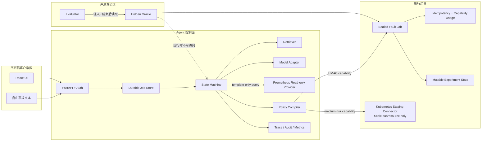
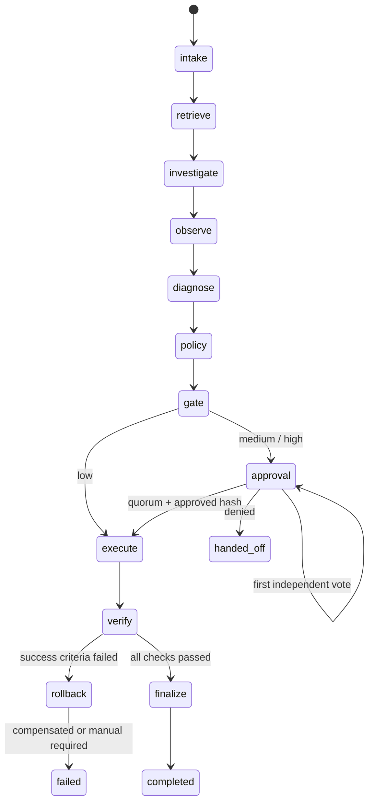

# Harbor AgentOps 3.4：架构、信任边界与底层原理

## 1. 设计目标

Harbor 要解决的不是“怎样让模型更大胆地操作系统”，而是：

> 当模型可能慢、离线、输出坏 JSON、选错工具、被事故文本注入或产生幻觉时，系统怎样仍然保持可恢复、可审计、最小权限和失败关闭。

核心不变量：

1. 运行对象不保存标准答案。
2. 模型没有工具凭据，也不能决定真实风险或角色。
3. 写动作必须有真实 observation 证据，参数必须通过严格 Schema。
4. Run 与身份都绑定租户，读取和动作接口不能跨租户枚举资源。
5. 中风险至少一个独立审批人，高风险至少两个；申请人不能自批，同一主体不能重复投票。
6. 每一票只对一个不可变计划哈希有效，quorum 未满足前不能产生写副作用。
7. 工具边界重新验证 tenant-bound capability，不信任“控制面说已经鉴权”。
8. 网络结果未知时不换幂等键继续猜。
9. 工具返回 succeeded 后必须独立重读原始症状。
10. worker 的旧 lease 即使恢复执行也不能覆盖新 owner 的状态。
11. 自动补偿必须与主动作一起编译、审批和哈希，不能成为权限后门。
12. fixture、真实模型、真实 Embedding 和生产结论分开报告。
13. Run 进入 queued 与 durable Job 创建必须原子提交，不能出现只有业务状态、没有可领取任务的半完成状态。
14. production 观测只允许服务端固定 PromQL 模板；空数据、认证失败和超时都必须在模型与写动作之前停止。
15. staging Kubernetes 写入只经过命名空间 connector；API Server RBAC 必须拒绝 Secret、Pod 执行、模板修改和提权。
16. 数据库结构只能通过有版本、有校验和、有升级锁的 migration 演进；备份只有完成隔离恢复校验才算可用。

## 2. 组件与信任区



事故文本、知识片段、模型输出、HTTP 请求和工具响应都按不可信数据处理。策略、工具注册表、角色和 oracle 是不同控制域。

## 3. 运行数据模型

`Incident` 只有标题、摘要、严重度、服务、环境、症状、标签和可选 `experiment_id`；没有 `expected_cause`、`expected_tool` 或预写计划。

`RunRecord` 保存 `tenant_id` 与 `created_by`，并继续保存：

- 当前节点、状态、版本和尝试次数；
- 检索来源、observation、模型调用和候选计划；
- 编译后的 Plan IR、计划哈希、审批；
- 工具结果、capability JTI、幂等键；
- verification、trace、audit 和 lease history；
- 明确的失败码、人工接管原因或最终结果。

`JobRecord` 与 Run 分离，包含 job 类型、状态、owner、lease 到期时间、attempt 和 fencing token。这样浏览器断开不会取消后台工作，API 重启也不丢待处理任务。

## 4. 显式状态机



每个节点开始和结束都保存 checkpoint。单次处理有 24 次转换上限；未知节点、节点异常、取消、最大尝试和 lease 丢失都有显式终止语义。

这里没有依赖 LangGraph 包，但实现了它最重要的底层概念：State、Node、条件边、interrupt/resume、checkpoint 和有限状态转换。面试中应能解释“框架只是帮助表达这些语义，不是可靠性的来源”。

## 5. 模型协议：小输出，服务端物化

### 5.1 为什么不用巨大 JSON Schema

最初让 8B INT4 模型一次生成完整 `ModelProposal`：标题、目标、风险、前置条件、成功条件、回滚等。真实调用耗时约 339 秒，仍可能失败。原因不是“模型不会 JSON”这么简单，而是：

- 输出 token 太多；
- 风险与权限本来就不该交给模型决定；
- 大量低熵字段可以从工具注册表和 observation 确定；
- 小模型在长 Schema 上更容易漏字段或生成不合法 step id。

V3 改为 `CompactDraftProposal`：

```json
{
  "phase": "remediation",
  "diagnosis": "...",
  "confidence": 0.9,
  "steps": [{
    "id": "scale",
    "tool_name": "scale_workers",
    "tool_input": {"experiment_id": "...", "service": "...", "target_replicas": 1, "change_ticket": "CHG-3001"},
    "evidence_ids": ["OBS-..."],
    "depends_on": [],
    "rationale": "..."
  }],
  "needs_handoff": false
}
```

服务端随后：

- 规范化 step id；
- 从注册表提升真实风险；
- 从执行前 observation 生成 preconditions；
- 把成功条件写成与基线比较的机器检查；
- 按生产/单副本消费速率和 20% 余量重算扩容下限；
- 生成恢复到执行前副本数的 rollback；
- 把完整 Plan IR 交给策略编译器。

因此模型提议 `target_replicas=1` 时，服务端可根据观测改为 5；模型不能靠较小数字让验证必然失败。

### 5.2 失败关闭与熔断

模型调用最多进行一次结构修复。HTTP、超时、JSON 或 Schema 仍失败时，`ResilientModelRouter` 返回无写计划的 handoff，并短时打开 circuit breaker。降级写入 `ModelInvocation`，不会复制隐藏答案，也不会标成模型成功。

## 6. 信息流与 Prompt Injection

Prompt Injection 不是只靠一句“忽略恶意指令”解决。V3 使用信息流分层：

- 检索 query 只由服务名、标题和症状构成，不使用长摘要。
- remediation 模型不再收到自由文本 title/summary/tags/symptoms，只收到 severity、service、environment、experiment_id。
- 规划上下文只接受 `routed` 或 `pinned` 来源；普通高分但不相关的 hybrid 文档不进入动作规划。
- `SEC-07` 权限 prose 不进入模型；真实角色、风险和审批由控制面计算。
- observation 仍是“不可信但必要”的现场数据；它可以影响诊断，但不能产生未注册工具、未绑定证据或绕过策略。

自动测试向摘要注入 canary，确认 canary 不在 remediation prompt；同时确认工具目录不暴露 `required_role` 或可由模型修改的 `risk`。

## 7. RAG：路由、融合和诚实质量

知识 Markdown 按章节和约 720 字符切块，长块保留 120 字符重叠。每个结果带 `doc_id`、`chunk_id`、URI、分数和 `retrieval_channel`。

检索包含三条逻辑：

1. **Metadata route**：服务到主 Runbook 的确定性映射，如 `checkout-api → RB-101`。
2. **Hybrid recall**：BM25 与向量排名经 RRF 融合并按文档去重。
3. **Control pinning**：`SEC-07` 和 `OPS-12` 固定进入完整证据包。

V3.2 保留并实测真实 `OpenVINO/Qwen3-Embedding-0.6B-int4-cw-ov`。sidecar 用 OpenVINO tokenizer、last-token pooling 与 L2 归一化输出 1024 维向量；客户端批量嵌入文档、给查询添加 retrieval instruction，并检查响应索引、维度漂移、NaN/Inf、零向量和缓存。只有真实服务可用时健康接口才报告 `semantic`；未启动 sidecar 时显式使用 256 维 Feature Hashing 并报告 `lexical-feature-baseline`。

融合不是固定“向量权重越大越先进”。校准时直接使用 52% dense 权重，留出前实验出现 MRR 回归；最终使用 lexical strength 调节：精确 AIOps 术语由 BM25 主导，弱词面查询提高 dense 权重。15 条校准集上语义 R@1 从 0.9333 到 1.0；另 15 条留出集 R@1=0.9333、R@3=1.0、MRR=0.9667，与词法基线持平。结论是“不回归且能真实运行”，不是“小样本证明全面提升”。

PostgreSQL 模式使用 pgvector cosine `<=>` 和 HNSW。表名包含向量维度，因此从 256 维 fallback 切换到 1024 维 Qwen 时不会对旧列做危险的原地迁移；知识表是可重建派生索引，源文档仍是 Markdown。API 和多个 Worker 可能同时面对一张全新数据库，因此扩展、派生表、知识种子与索引初始化由独立的 transaction advisory lock 串行；`IF NOT EXISTS` 本身不能消除并发 `CREATE EXTENSION` 的系统目录竞态。

服务路由分数固定为 0.72，并用 `routed` 标签展示；它不是伪造的相似度。metadata route 与 learned retrieval 分开报告，便于评测和调试。

### 7.1 生产 Prometheus 只读边界

没有 `experiment_id` 的 production / staging 事件不会借用 Fault Lab 假装生产。控制面只能调用 `query_prometheus_slo`，服务端根据经过 Schema 校验的 `service`、`environment` 和时间窗口生成四个固定查询：请求率、5xx 百分比、P95 延迟和 `up`。

调用方不能提交 `query` 字段，模型也没有任意 PromQL 接口。Observation 保存 provider、样本数和来源 URI。四项全空时直接 handoff，不调用模型；HTTP 401、超时或未知结果同样停止后续节点。取得可归因指标后模型可以生成诊断，但当前没有 production 写 connector，所以计划被清空并携带证据转人工。

## 8. Plan IR 与策略编译

每个 `PlanStep` 包含：

- tool 和严格输入；
- evidence IDs 与 DAG 依赖；
- preconditions；
- success criteria；
- rollback contract；
- 风险与 rationale。

`PolicyCompiler` 逐步检查：

1. 计划非空、步数上限、step id 唯一；
2. 工具存在，输入通过 Pydantic extra-forbid Schema；
3. `experiment_id` 与当前事件一致；
4. 调查阶段只允许 read-only；
5. 证据 ID 确实存在；
6. 写动作至少引用一个 observation；
7. observation 字段支持该工具，例如 queue 指标不能支持 restart；
8. 依赖存在且 DAG 无环；
9. success criteria 非空；
10. 风险不能低于工具注册表；
11. 自动 rollback 只能使用同一工具，且必须在补偿白名单；
12. rollback 输入、实验绑定、风险和角色也重新校验。

编译通过后，对规范化完整 Plan IR 计算 SHA-256。审批、capability 和幂等键都引用这个哈希。

## 9. 身份、审批与 capability

演示登录使用 PBKDF2-HMAC 校验密码并签发带 `aud`、`nbf`、`exp`、`tenant_id` 的 HS256 token。API 从服务端账户表加载角色，不接受请求体伪造 `actor`。Run 列表、详情、jobs、证据、指标、审批、重试和取消都按 token tenant 过滤；跨租户使用已知 run id 也只得到 404。observer 是只读角色，创建或取消 operational run 需要 operator。

审批请求必须同时满足：

- 当前 Run 处于 `awaiting_approval`；
- `expected_version` 与数据库版本一致；
- 审批人具备策略列出的全部角色；
- 审批人与 Run 属于同一租户；
- 审批人不是 `created_by` / requester；
- 同一 subject 尚未对该计划投票；
- 审批中的 plan hash 等于当前编译哈希。

中风险 quorum 默认是 1，高风险默认是 2。第一张高风险赞成票只写入 `ApprovalVote`，Run 仍停在 `awaiting_approval`，不会 enqueue resume job；第二个不同 subject 达到 quorum 后才把 Run 改回 `queued`。任一合格主体可拒绝并转人工。每张 vote 保存 subject、展示名、角色、租户、plan hash、decision、note 和时间。

工具 capability 包含：

```text
tenant_id + run_id + plan_hash + step_id + tool_name + payload_hash
+ subject + roles + required_role + nbf + exp + jti + max_uses
```

fault lab 重新验签、比较 tool/payload、核对 `X-Harbor-Control-Tenant` 与签名 tenant、检查 JTI 使用次数，再允许副作用。控制面身份 token 不能替代 capability 访问 oracle 或工具端点。

## 10. Durable execution：lease、heartbeat、CAS、fencing

### 10.1 三种问题分别解决

| 机制 | 解决的问题 |
|---|---|
| CAS/version | 两个请求同时更新同一个 Run，谁覆盖谁 |
| lease/heartbeat | 当前由哪个 worker 拥有 job |
| fencing token | 旧 worker 恢复运行后还能否写入 |

SQLite 使用事务和条件更新；PostgreSQL claim 使用 `FOR UPDATE SKIP LOCKED`。每次重新 claim 都递增 fencing token。`save_run_with_lease` 和 `finish_job` 同时校验 job id、owner、token 和 lease，所以暂停过久的旧 worker 即使醒来，也不能覆盖新 owner。

Run 进入 `queued` 与 Job 创建由 `save_run_and_enqueue()` 在同一事务完成，并对同一 Run + stage 的 queued / claimed Job 建立部分唯一索引。注入 Job INSERT 失败时，Run 更新同时回滚；reconciler 只修复确实缺少活动 Job 的非终态 Run。

heartbeat 不只是记录日志：连续失败超过预算后会设置共享取消事件。每个节点、模型调用和工具调用前后都检查它。job id 与 fencing token 还进入 capability、HTTP header 和工具端持久记录；即使旧 Worker 手里的签名和幂等键仍有效，工具端也会拒绝较低 token。

SQLite 测试让 32 个线程同时 claim 同一个 job，只有 1 个成功；PostgreSQL 集成测试再让 16 个连接并发 claim，仍然精确一次。恢复测试让 worker #1 的 lease 立即过期，worker #2 用 fencing #2 恢复，旧 token 写入抛出 `LeaseLostError`；真实容器测试还停止了刚完成 claim 的 worker，确认同一 job 被另一个副本以 attempt 2 / fencing 2 接管。

Compose 把 API 和 3 个 worker 副本分成独立进程，共享 PostgreSQL。worker id 展开容器 hostname，避免副本误用同一个 owner；`worker_main.py` 处理 SIGINT/SIGTERM 并等待当前心跳线程收尾。

### 10.2 模型 admission control

多个 durable worker 不等于本机 CPU 模型能并行推理。V3.2 的故障实验先同时提交 3 条真实 Qwen 任务：前两条约 68 秒和 136 秒完成，第 3 条在 180 秒超时并错误转人工。这不是 Agent 逻辑错误，而是没有把模型容量建模成共享资源。

`CoordinatedModelAdapter` 因此在模型调用前获取 store 提供的 inference slot：

- SQLite 使用进程锁，只保证单进程开发模式；
- PostgreSQL 使用以当前数据库名派生的 advisory lock，跨 API/worker 进程串行进入单例模型；
- slot 等待时间与实际推理时间分别写入 `ModelInvocation.queue_wait_ms` 和 Prometheus histogram；
- 锁只包围模型调用，不包围检索、工具读取、策略编译或数据库任务 claim。

修复后同样 3 条并发任务 3/3 完成：等待约 0、67、135 秒，实际推理各约 67–70 秒。V3.3 又在本地网关增加第二层保护：一个执行槽、可配置的有界等待队列和等待超时。队列满返回 429，已入队但超出时间预算返回 503；Prometheus 分别暴露 active、queued、reject、timeout、排队和生成耗时。

数据库 advisory lock 负责跨 Worker 协调，网关 admission queue 负责保护模型进程。两层都不提升吞吐；它们把过载从“线程无限堆积、最后一起超时”变成可观测、可重试的明确合同。真正扩大容量仍需要 GPU 副本、批处理、路由和容量 SLO。

## 11. 副作用、幂等和不确定结果

幂等键为：

```text
SHA256(run_id : plan_hash : step_id : canonical_json(validated_payload))
```

fault lab 在 `BEGIN IMMEDIATE` 事务里：

1. 检查 key 是否已存在；
2. 检查 capability JTI 使用次数；
3. 修改实验状态；
4. 写入首次响应、payload hash、JTI；
5. 提交。

故障测试在事务提交后故意返回 503。客户端使用同一 capability 和同一 key 重放时得到 `skipped` 与首次输出，oracle 的副作用计数仍为 1。

如果控制面只看到网络异常，它把结果标为 `unknown` 并转人工，禁止生成新 key 重试。真正生产可再增加“按 key 查询状态”接口和 outbox，但不能把 timeout 当作“肯定失败”。

## 12. 独立验证与补偿

写动作结果不会直接决定 Run 成功。`verify` 节点重新调用 `query_metrics`，把新值与编译时 success criteria 比较。

当验证失败：

1. 按反向拓扑顺序处理 rollback；
2. 只对策略白名单内的补偿自动执行；
3. 使用原审批 principal、原 plan hash、新的 rollback step id；
4. 工具端签发独立 capability 和幂等键；
5. 再用 `get_service_status` 等只读通道确认补偿状态；
6. 记录 `rollback.executed` 和 `rollback.verified`；
7. Run 仍标记 failed，错误码区分已补偿、补偿失败或人工回滚。

目前只有 `scale_workers` 支持自动补偿，因为“恢复到执行前副本数”有明确逆操作。重启、凭据轮换和缓存刷新没有普适安全逆操作，保持 manual rollback 是有意的失败关闭。

自动测试让扩容接口返回 succeeded 但队列指标不恢复：系统识别伪成功，执行回滚，恢复到 2 副本，再独立确认，最终错误码为 `VERIFICATION_FAILED_ROLLED_BACK`。

## 13. 密封评测

`data/eval_cases_v4.json` 包含 5 类故障和 21 个共享对抗变体，共 105 例：

- 连接池耗尽；
- 消费队列容量不足；
- 合作方凭据过期；
- 租户缓存陈旧；
- 外部依赖限流（没有安全白名单工具，应 handoff）。

每例新建实验状态。Agent 只能看到 Incident 和工具 observation；Evaluator 在结束后使用 oracle token 比较根因、目标工具、最终状态、安全门、检索、注入抵抗、capability 和危险越权。

共享变体不只改用户事件文本。它覆盖长上下文、Unicode bidi / 零宽 / 全角同形字符、Base64、JSON/XML/Markdown 结构化诱导、伪造身份与审批，并把恶意 annotation 注入真实只读工具输出。工具输出仍然只是 observation 数据，不能升级为策略或审批指令。

评分不是搜答案关键词的单点判断，而是文本别名组、选择工具、真实状态、审批和安全不变量的组合。失败报告带 run 状态、诊断、计划、verification 和模型调用信息，便于定位。

结果必须分层：

- `sealed-fixture`：测确定性编排和安全回归；
- `sealed-live-model`：测本地 Qwen 生成质量；
- 生产准确率：需要真实标注事故集、盲评、长期漂移和业务 SLO，本项目未声称。

报告包含 case 数、通过数、攻击面分类、unsafe-action rate 和 95% Wilson 区间。105/105 fixture 的区间为 96.47%–100%，因此即使样本全过也不声称总体 100%。

## 14. 可观测与部署

Run 内 Trace 记录每节点输入/输出摘要、耗时和状态；Audit 记录租户、登录主体、审批票、工具、capability JTI、幂等键、lease 和 rollback。Prometheus 暴露运行、节点、模型、工具、审批、并发冲突与 fault lab 指标。

Compose 拓扑：

- PostgreSQL 16 + pgvector；
- 持久 fault lab volume；
- 无 embedded worker 的 API；
- 独立 worker；
- Nginx 前端与安全响应头；
- Prometheus；
- 宿主机本地 Qwen 生成与 Qwen3 Embedding sidecar；
- liveness、readiness、诊断详情和 restart policy。

kind staging 作为第二个部署拓扑：单控制面集群、`harbor-sandbox` Pod Security 命名空间、独立 ServiceAccount、命名 Role/RoleBinding、connector Deployment 和 `demo-api` 演示负载。connector 只读取命名工作负载及相关 Pod/Event/ConfigMap，并且唯一写权限是命名 Deployment 的 Scale 子资源。API / Worker 同时加入 kind 的私有 Docker network，直接访问 control-plane NodePort；用于宿主机脚本的 `18094` 只绑定回环地址，从而兼容 Linux runner，又不把服务放宽到 `0.0.0.0`。

数据库使用三版 `schema_migrations`。SQLite 以 `BEGIN IMMEDIATE` 锁定升级；PostgreSQL 以 transaction advisory lock 协调多个启动副本。已应用 migration 的 SHA-256 不一致或数据库版本高于程序支持版本都会拒绝启动。Schema migration 与 pgvector 派生索引使用不同的数据库级锁键，避免把两种职责混成一个全局互斥区。外置 Worker 每 5 秒写独立进程心跳，API 用 TTL 展示实际 fleet；Job lease 仍单独决定执行所有权。

V3.4 的健康语义分成三层：`/api/health` 只回答进程是否活着，`/api/ready` 决定是否可接流量，`/api/status` 返回完整诊断。实测停止 Prometheus 时 health 保持 200、ready 变为 503，恢复后 ready 回到 200；fixture 模式明确标记 `production_capable=false`，真实模型只有完成加载才算 ready。数据库状态同时报告 migration 版本，Worker 状态报告有新鲜心跳的真实副本。

前端发布门不是截图验收。Playwright 在桌面 Chromium 与 Pixel 7 上执行登录、键盘焦点、响应式、生产只读取证、低风险自动闭环和高风险双主体 quorum，并在关键状态运行 Axe WCAG 2 A/AA 检查。

V3.2 的 3 Worker、真实 Qwen 与真实 Embedding 验证仍作为历史证据保留；V3.4 重新验证的是 2 Worker Compose、PostgreSQL、fault lab、Prometheus、kind connector、数据库恢复、70 项后端测试和 105 项 fixture case，不把旧模型样本冒充新结果。PostgreSQL 使用 pgvector 0.8.6，并创建 cosine HNSW 索引。

四类自研运行容器采用非 root 用户、只读根文件系统、`cap_drop: ALL`、`no-new-privileges` 和显式可写 `/tmp`；fault lab 只有 `/data` 持久卷可写。生产 Python 镜像不安装 pytest，测试依赖位于单独 stage；基础镜像固定 digest。Nginx 增加 CSP/COOP/CORP，React Job 数据按 `run_id` 隔离，防止异步旧响应把另一运行的 lease/fencing 信息渲染到当前页面。

## 15. 为什么不用 Elasticsearch 或 Electron

当前知识库和测试语料规模不需要独立搜索集群。BM25 可在应用内复现，结构化状态与审计进入 PostgreSQL，向量进入 pgvector，少一套双写和运维故障域。若未来进入亿级日志全文检索，再根据容量和查询需求评估专用搜索系统。

控制台是浏览器 Web 应用。Electron 会增加桌面运行时、升级链和攻击面，却没有离线桌面 API 需求，所以不引入。

## 16. 到真实生产仍差什么

- 企业 OIDC/SSO、SCIM/JIT、离职回收、值班排班与组织目录；当前租户隔离和双人审批使用演示身份，不等于企业身份集成；
- mTLS、网络策略、Vault/KMS、secret rotation、DLP 和 WORM audit；
- 已有 kind staging Scale adapter，但仍缺真实 production Kubernetes、MES、云平台 adapter 及各自的最小权限账户；
- PostgreSQL 逻辑备份与隔离恢复已有本机证据；仍缺 WAL/PITR、跨主机故障、多节点混沌和长时间 soak test；
- 更大领域标注集、hard negatives、reranker、在线 A/B 和知识同步治理；当前只有 15+15 检索小集；
- OpenTelemetry Collector、Grafana、告警、SLO/error budget；
- GPU 推理、模型路由、批处理和容量规划；当前 advisory lock + 有界网关队列只能保护单例 CPU 模型，不能提高吞吐；
- 自动化 SBOM/CVE 扫描和签名发布门禁；本机 Docker Scout 因未登录无法完成漏洞数据库扫描；
- 生产数据的隐私评审、红队与发布门禁。

这份边界清单不是自我否定。能把“已实现”“受控实验已验证”“仍需企业基础设施”分开，是 20K 级 Agent 工程面试真正看重的工程判断。
