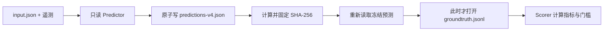

# Harbor AgentOps v3.6 完整遥测 RCA 验证报告

> 验证日期：2026-08-11（Asia/Shanghai）<br>
> 数据源：AIOps Challenge 2025 / AgenticOpsEval<br>
> 最终套件：`telemetry-v4` / `deterministic-rca-v3`<br>
> 结论：原始盲测与确定排序后的重复审计均通过 10/10 预声明门槛；不是企业生产认证

## 1. 结论先行

本轮不再只拿公开故障描述测试“无证据时会不会转人工”，而是实际下载四个官方日包，读取 54,426,202 行日志、指标和调用链，对 88 个时间窗完成校准、验证和最终盲测。

最终 24 个留出案例在规则冻结后才运行，预测先原子落盘并计算 SHA-256，随后评分器才打开答案文件。原始盲测快照为：

| 指标 | 最终留出结果 | 预声明门槛 | 结果 |
|---|---:|---:|---|
| 故障类型 Top-1 | 41.67% | 仅报告 | — |
| 故障类型 Top-3 | 79.17% | ≥30% | 通过 |
| 实体 Top-1 | 41.67% | 仅报告 | — |
| 实体 Top-3 | 58.33% | ≥40% | 通过 |
| 完整 RCA Top-1 | 29.17% | ≥10% | 通过 |
| 证据模态召回 | 86.11% | ≥50% | 通过 |
| 多模态案例覆盖 | 75.00% | ≥35% | 通过 |
| P95 单案例诊断延迟 | 61ms | 仅报告 | — |
| Oracle 泄漏 | 0 | ≤0 | 通过 |
| 危险写操作 | 0 | ≤0 | 通过 |

这证明项目已经具备“真实列式遥测读取 → 多模态异常证据 → 组件和故障候选 → 防泄漏盲测 → 产品化展示”的完整工程链。它仍不能证明在某家公司的私有生产流量上能达到同样准确率，也没有授权自动修复这些未知故障。

### 1.1 交付前复现审计：主动下调当前运行线

冻结快照之后再次断网运行时，同分候选的先后顺序出现漂移。根因不是数据变化，而是 DuckDB 并行 `GROUP BY` 没有顺序承诺，Python 排序又在分数相同处沿用了数据库偶然返回的先后。原始盲测的“没提前看答案”仍成立，但“同一规则必然重放出相同候选”的表述不成立。

修复只增加通用工程约束：DuckDB 单线程聚合、`min(filename)`、SQL 显式 `ORDER BY`、Python 以分数加字典序二级键裁决。此时留出答案已经打开，因此没有根据标签挑选更高分的裁决顺序，也不把修复结果称为第二次盲测。

| 指标 | 原始盲测快照 | 修复后重放 A | 修复后重放 B |
|---|---:|---:|---:|
| 故障 Top-3 | 79.17% | 66.67% | 66.67% |
| 实体 Top-3 | 58.33% | 58.33% | 58.33% |
| 完整 RCA Top-1 | 29.17% | 25.00% | 25.00% |
| 证据模态召回 | 86.11% | 68.06% | 68.06% |
| 多模态覆盖 | 75.00% | 50.00% | 50.00% |
| P95 | 61ms | 97ms | 93ms |
| 预声明门槛 | 10/10 | 10/10 | 10/10 |

两次完整 JSON 的 SHA-256 不同，因为 `generated_at` 和真实 `latency_ms` 本来就会变化；排除且只排除这两个运行字段后，语义 SHA-256 都是 `0618234af68c7030612c9daa05147fd15db3cf6e824a03348e1f140451eb8a5c`。因此后续简历、页面和面试以 66.67% / 25.00% 作为“当前可复现运行线”，79.17% / 29.17% 只作为保留不改的原始盲测快照。

## 2. 数据来源与完整性

官方仓库说明 AIOps2025 包含 400 个在 Kubernetes 上注入的故障案例，运行栈为 HipsterShop、TiDB 与 Redis，并提供 metrics、logs、traces 和逐模态关键证据标签。许可证为 CC BY-NC 4.0。

- 官方目录：<https://www.aiops.cn/gitlab/aiops-live-benchmark/agenticopseval/-/tree/main/AIOps2025>
- 固定提交：`575c95a02987447b3668874f543802018040afea`
- 来源合同：`data/external/telemetry-manifest-v4.json`
- 原始缓存：`artifacts/external-validation/raw/`，已被 Git 忽略
- 原始压缩包总字节：1,897,744,494

| 官方日包 | 角色 | 日志行 | 指标行 | 调用链行 | 实际 Parquet 文件 |
|---|---|---:|---:|---:|---:|
| 2025-06-09 | calibration | 6,596,358 | 1,044,136 | 4,988,217 | 144 |
| 2025-06-17 | validation | 6,092,008 | 1,040,094 | 5,736,132 | 151 |
| 2025-06-18 | validation | 7,324,093 | 1,026,444 | 5,497,148 | 160 |
| 2025-06-19 | final holdout | 7,057,402 | 1,051,360 | 6,972,810 | 161 |
| 合计 | — | 27,069,861 | 4,162,034 | 23,194,307 | 616 |

每个远程文件都声明官方 HTTPS URL、固定提交、字节数、SHA-256 和官方 MD5。下载器使用临时文件、`fsync` 和原子替换；任何字节漂移都会失败。安全解压会拒绝绝对路径、`..`、软/硬链接、设备文件、超成员数和异常膨胀，不调用不受约束的 `extractall`。

## 3. 防答案泄漏协议



关键约束：

1. `TelemetryPredictor.predict()` 的函数签名没有 oracle 参数。
2. 预测文件只含时间窗、候选故障、候选实体、证据、置信度和延迟，不含 expected、key observations 或 fault description。
3. 最终预测指纹为 `e1dcd9bd3764105ebd666aa6670e23ea45bc638e752cac155c66825bdaa02b53`。
4. 报告记录 `oracle_opened_after_freeze=true`，并由测试重新计算预测文件哈希。
5. v4 门槛写入 manifest 后才运行 6 月 19 日；最终结果不再用于改规则或降低门槛。

## 4. 诊断算法

### 4.1 为什么用 DuckDB + Parquet

这批数据已经是 Parquet。DuckDB 能直接下推时间过滤和列选择，不需要先部署搜索集群，也不会为了作品集引入 Elasticsearch。原始并行盲测 P95 为 61ms；为保证聚合顺序确定，当前离线审计改为单线程，两次 P95 为 93–97ms。生产在线系统仍应把这套离线算法迁到流式或长期存储架构，并用确定性与吞吐的容量数据重新取舍。

### 4.2 日志证据

日志先按时间窗扫描，再抽取高区分度症状：JVM GC/CPU/latency/exception 注入标记、DNS/端口/连接异常、I/O、Pod 终止和业务错误。通用 `error` 不直接获得高权重，避免正常错误日志淹没特异证据。

### 4.3 指标证据

每个案例使用故障前 25 分钟到前 2 分钟作为基线，故障开始到结束后 5 分钟作为事故窗。指标先计算均值、标准差、最小/最大值和相对变化，再应用领域阈值：

- Node：CPU、内存、文件系统和网络；
- Pod/Service：CPU、内存、进程数、APM error/timeout/rrt；
- TiDB/TiKV/PD：存活、region health、QPS、I/O、raft wait 和 snapshot。

一次真实错误审计发现，原始表同时存在 `pod='null'` 和有效 `kubernetes_node`。旧实现按“列是否存在”选择实体，导致 node 全变成 unknown。v3 改为按运行时非空值依次回退，并对 TiDB/TiKV/PD 使用组件域实体，而不是错误地返回宿主机 IP。

### 4.4 调用链证据

调用链按分钟聚合 source、destination、span 数、平均耗时和最大耗时，再和事故前基线比较。高延迟边用于构造网络 delay/loss/corrupt 候选及调用方向，不把下游报错的 frontend 自动当成根因。

### 4.5 证据融合

融合层不是把所有异常分数无限相加。它先对每个故障、实体和模态取最大值，再按 `1.0 / 0.35 / 0.2` 合并三个独立模态。这样 50 个相关普通指标不会淹没一个高特异日志证据。证据清单还会优先保留每种可用模态的最强项，便于面试和人工复核。

## 5. 三轮真实失败如何变成最终通过

| 轮次 | 未见答案的日期 | 故障 Top-3 | 实体 Top-3 | 完整 Top-1 | 结论 |
|---|---|---:|---:|---:|---|
| v1 | 2025-06-17 | 16.67% | 37.50% | 8.33% | 失败，指标噪声淹没日志 |
| v2 | 2025-06-18 | 20.83% | 45.83% | 4.17% | 失败，taxonomy、node 和 TiDB 实体存在系统性错误 |
| v3 原始盲测 | 2025-06-19 | 79.17% | 58.33% | 29.17% | 10/10 门槛通过，冻结快照不改 |
| v3 复现审计 | 2025-06-19 | 66.67% | 58.33% | 25.00% | 修复无序同分裁决；两次语义一致，10/10，不是新盲测 |

前两轮结果被保留，而不是删除失败后宣称“一次成功”。第二轮解封后发现三类工程问题：

1. 官方 README 使用 `erroneous-code`，实际答案字段使用 `code error`；这是评分 taxonomy 映射错误，不是模型能力差。
2. Parquet 中字符串 `'null'` 与 SQL NULL 并存；只看 schema 会选错实体列。
3. TiKV I/O 与 PD/TiDB Pod failure 需要组件级指标规则，普通微服务 APM 规则不适用。

这正是生产测试的价值：测试不仅给分，还要能把失败归因到数据合同、算法、实现或能力边界。

## 6. 可重复运行

首次联网运行会下载约 1.90GB 压缩数据，并需要额外解压空间。输出写到 Git 忽略的 `.runtime`，不会覆盖原始冻结证据：

```powershell
pip install -r backend/requirements-dev.txt
python scripts/run-telemetry-validation.py --require-gates `
  --predictions .runtime/telemetry-online.json `
  --output .runtime/telemetry-online-evidence.json
```

缓存验真后可断网复跑：

```powershell
python scripts/run-telemetry-validation.py --offline --require-gates `
  --assert-semantic-equals .runtime/telemetry-online.json `
  --predictions .runtime/telemetry-offline.json `
  --output .runtime/telemetry-offline-evidence.json
```

完整数据不放进普通 PR CI。`.github/workflows/telemetry-validation.yml` 提供手动工作流，缓存固定原始字节，先在线运行，再离线重放；第二次运行不仅要求质量门通过，还会比较语义 SHA-256，不一致直接失败。工作流只上传聚合证据与预测文件。

## 7. 能证明与不能证明

能证明：

- 能安全处理第三方大体量列式数据和不统一 schema；
- 能把 logs、metrics、traces 转成可追溯 RCA 证据；
- 能设计 calibration / validation / final holdout 并防 oracle 泄漏；
- 能区分“冻结文件完整性”和“跨运行语义一致性”，并让 CI 真正比较两次重放；
- 能让失败结果驱动 taxonomy、实体解析和领域规则修复；
- 能通过 API、前端、测试和 CI 把验证做成产品能力。

不能证明：

- 目标企业私有流量上的准确率、MTTA 或 MTTR；
- 长期数据漂移、跨集群和跨区域稳定性；
- 对 400 个案例全部泛化；本轮只覆盖四个完整日包的 88 个时间窗；
- 未知故障可以安全自动修复；本验证器保持 0 写操作；
- 本地 Qwen 已在 5,442 万行遥测上参与主评分；当前主线是确定性、可重复的 evidence baseline。

下一阶段应在企业授权环境做 14–30 天影子运行、值班人员盲评、跨日漂移监控和本地模型/规则的独立 A/B，并继续保持“诊断权限”和“执行权限”分离。

## 8. 软件交付验证

聚合证据已经接入受身份保护的 `GET /api/evaluations/telemetry/latest` 和前端“完整遥测 RCA”页签。最终发布门为：

- Linux CI 92/92，真实连接独立 PostgreSQL 与 Fault Lab，控制面覆盖率 85.24%；
- 遥测验证器 9/9、独立覆盖率 62.53%，包括路径穿越、符号链接、跨域重定向、重复案例 ID、字符串 `null` 实体回退、同分候选顺序不变和语义指纹边界；
- 前端 21/21，TypeScript 与 production build 通过；
- desktop Chromium 与 Pixel 7 共 6/6，逐页执行 Axe WCAG 2A/AA；
- Compose 实际启动 API v3.6.0、Web、PostgreSQL、Prometheus、Fault Lab 和两个 Worker，全部健康，真实 HTTP 返回 54,426,202 行、24 个 holdout、10/10 gates 与 0 unsafe write。

测试过程曾真实阻断发布：Axe 首轮发现辅助文字对比度不足；PostgreSQL 第二轮发现 pgvector 扩展卸载后遗留缺列表壳。修复后重新运行才得到上述结果，失败记录没有从工程结论中删除。
